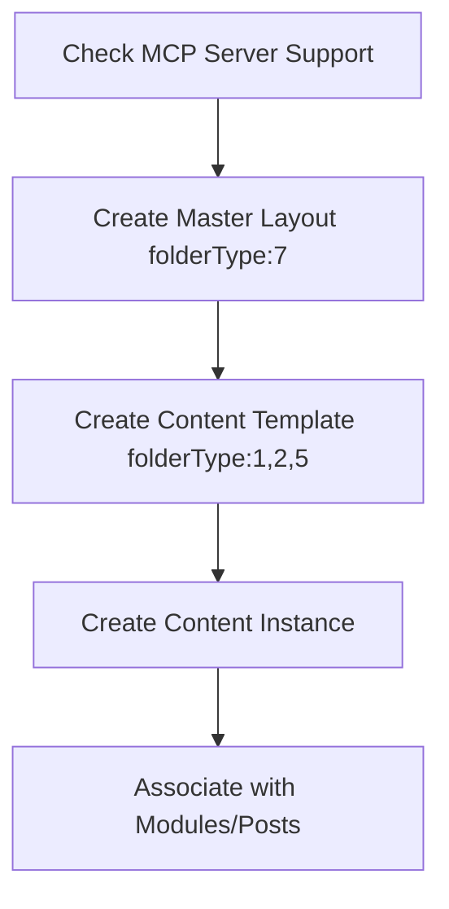

# Mixcore CMS: System Architecture Overview

Vector-optimized reference for Mix CMS architecture, components, and integration patterns.

## 🏗️ Core Architecture

### Foundation
- **Framework**: ASP.NET Core MVC with Razor Pages
- **Design**: Modular, component-based architecture
- **AI Integration**: Native MCP (Model Context Protocol) support
- **Data Management**: Dynamic schema via MixDb
- **Deployment**: Multi-tenancy, headless API capabilities

### Key Characteristics
- **AI-First**: Built for AI agent collaboration via 70+ MCP tools
- **Dynamic**: Create databases and schemas using natural language
- **Extensible**: Custom modules and template patterns
- **Scalable**: Cloud-ready with container support
- **Unified**: Standardized AI-CMS interaction through MCP

## 🧩 System Components

### 1. Content Architecture
```csharp
// Content Hierarchy
Templates (Design) → Content (Data) → Rendered Pages

// Template Types (folderType enum)
Masters = 7     // Site-wide layouts
Pages = 1       // Page templates
Modules = 2     // Reusable components
Posts = 5       // Blog/article templates
Forms = 3       // Input forms
Widgets = 6     // UI components
```

### 2. MixDb Dynamic Database
```csharp
// Schema Creation
CreateDatabaseFromPrompt("Create products table with name, price, description")

// Data Population
CreateManyMixDbData(tableName, jsonDataArray)

// Data Retrieval
SearchMixDbRequestModel with filtering, sorting, pagination
```

### 3. MCP Protocol Integration
```csharp
// Tool Categories
Template Management: CreateTemplate, ListTemplates, UpdateTemplate
Content Operations: CreatePageContent, CreatePostContent, CreateModuleContent
Data Management: CreateDatabaseFromPrompt, GetListMidxDbData
Relationship Handling: CreateMixDbRelationshipFromPrompt
```

## ⚙️ Development Patterns

### Template Creation Workflow


### Data-Driven Content Flow
```csharp
// 1. Schema Definition
CreateDatabaseFromPrompt(
    displayName: "Products",
    schemaDescription: "Product catalog with name, price, description, image"
)

// 2. Data Population
CreateManyMixDbData(
    databaseSystemName: "products",
    dataJson: "[{\"name\":\"Product1\",\"price\":99.99}]"
)

// 3. Template Integration
@{
    var mixDbDataService = mixDbDataServiceFactory.Create(...);
    var request = new SearchMixDbRequestModel { TableName = "products" };
    var products = await mixDbDataService.GetListByAsync(request);
}

// 4. Data Rendering
@foreach (var product in products) {
    <div>@(product.Value<string>("name"))</div>
}
```

## 🤖 AI Agent Integration

### Agent Protocol Requirements
1. **Identity Maintenance**: Always operate as Mix AI Agent
3. **Tool Documentation**: Record which MCP tools were used
4. **Fallback Strategy**: Use C# only when MCP tools insufficient

### Critical Constraints
```csharp
// Template Naming
fileName: "TemplateName"    // No extension
extension: ".cshtml"        // Include dot

// Image Handling
imageUrl: "https://images.unsplash.com/..."  // Full public URLs only

// Content Relationships
CreatePageModuleAssociation()   // Page-Module links
CreateModulePostAssociation()   // Module-Post links
```

## 🚀 System Capabilities

### Content Management
| Feature | MCP Tool | Purpose |
|---------|----------|---------|
| **Templates** | `CreateTemplate` | Design layout and presentation |
| **Pages** | `CreatePageContent` | Static/dynamic webpage creation |
| **Posts** | `CreatePostContent` | Blog and article management |
| **Modules** | `CreateModuleContent` | Reusable component blocks |
| **Data** | `CreateDatabaseFromPrompt` | Dynamic schema creation |
| **Relationships** | `CreateMixDbRelationshipFromPrompt` | Content associations |

### Data Query Patterns
```csharp
// Basic Query
var request = new SearchMixDbRequestModel
{
    TableName = "tableName",
    Queries = new List<MixQueryField>(),
    SortBy = "fieldName",
    Direction = "Ascending"
};

// With Relationships
var request = new SearchMixDbRequestModel
{
    TableName = "tableName",
    LoadNestedData = true  // Include related data
};
```

## 🔄 Content Lifecycle

### 1. Creation Phase
- Schema design via `CreateDatabaseFromPrompt`
- Template creation with appropriate `folderType`
- Content instance creation with template association

### 2. Association Phase
- Link pages with modules via `CreatePageModuleAssociation`
- Connect posts with categories via relationships
- Establish data hierarchies

### 3. Rendering Phase
- Razor templates with dynamic data injection
- Partial view rendering with "../{FolderType}/" pattern
- Field access via `Value<T>("fieldName")` methods

### 4. Management Phase
- Update operations via `Update[ContentType]Content`
- Deletion via `Delete[ContentType]Content`
- Schema modifications through natural language

## 💡 Architecture Strengths

### AI-Native Design
- **MCP Integration**: Standardized AI-CMS communication
- **Natural Language**: Database schema creation via prompts
- **Agent Collaboration**: Built for AI-assisted development
- **Tool Ecosystem**: 70+ specialized MCP tools

### Dynamic Flexibility
- **Runtime Schema**: Create/modify databases without deployment
- **Template Patterns**: Reusable design components
- **Modular Architecture**: Extensible via custom modules
- **Multi-Tenancy**: Support multiple sites/clients

### Developer Experience
- **ASP.NET Core**: Familiar .NET development patterns
- **Razor Views**: Server-side rendering with C# integration
- **Type Safety**: Strongly-typed models and services
- **Documentation**: Vector-optimized instruction set

## ⚠️ Current Limitations

### Technical Constraints
- Template partial paths require "../" prefix
- Database column names are case-sensitive
- Complex relationships need explicit documentation
- Image management requires external URLs

### Workflow Requirements
- Master Layout must be created before pages
- Template associations must use correct folderType values
- Relationships require `loadNestedData: true` for nested queries
- Documentation updates needed for team collaboration

## 🎯 Vector Search Optimization

### Key Terms
**Architecture**: ASP.NET Core MVC, modular design, component-based, multi-tenancy
**AI Integration**: MCP protocol, Mix AI Agent, model context protocol, 70+ tools
**Content Management**: templates, pages, modules, posts, dynamic schema, MixDb
**Development**: Razor views, folderType enum, template patterns, data relationships
**Workflow**: MCP-first approach, natural language schema, content lifecycle

### Common Queries
- "How to create page templates in Mix CMS"
- "MCP tools for database management"
- "Template folderType values and usage"
- "Dynamic content with MixDb queries"
- "AI agent protocol for Mix CMS development"

> **Version**: Mixcore CMS 5.0 (2025)  
> **License**: Commercial with open-core elements  
> **Requirements**: .NET 9, ASP.NET Core MVC
